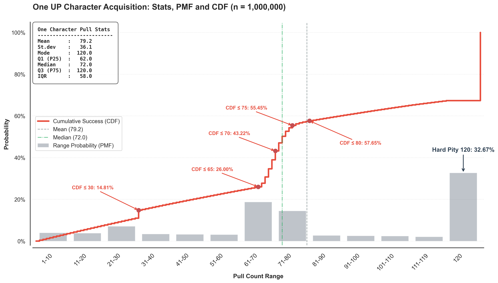
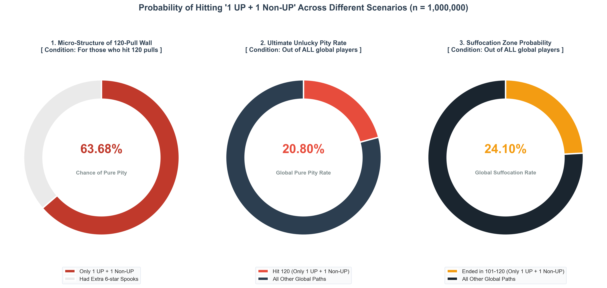
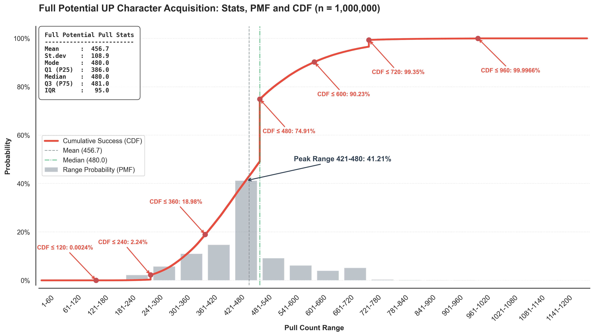
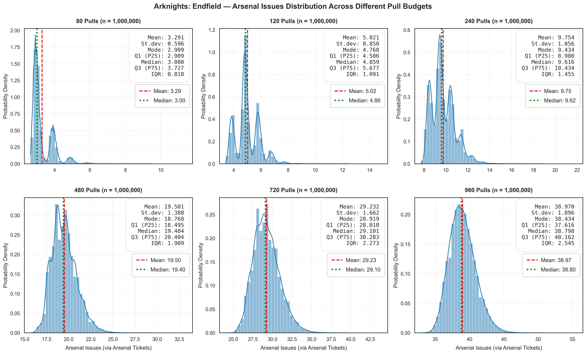
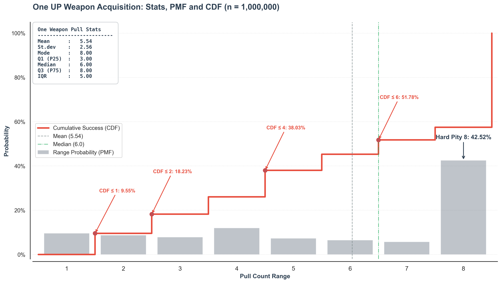
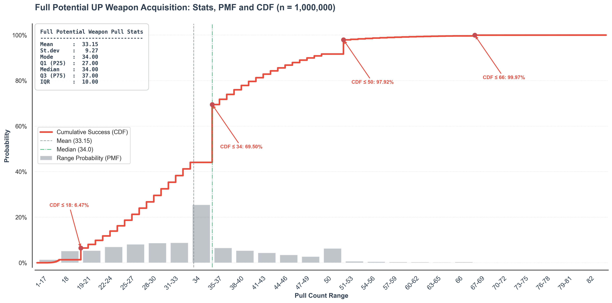
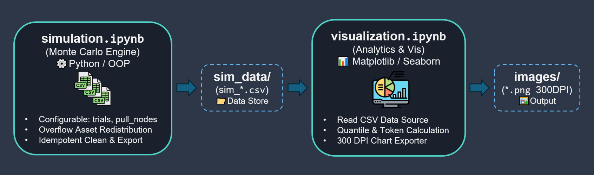

# Arknights: Endfield Gacha Simulation and Data Analysis 📊
> 《明日方舟：終末地》卡池蒙地卡羅模擬與數據分析

---

## 🌐 Language / 語言
- [English](#english)
- [繁體中文](#繁體中文)

---

## English

This project provides a comprehensive statistical analysis and visualization suite specifically tailored for the gacha mechanics in *Arknights: Endfield*. By simulating over 1,000,000 trials via Monte Carlo methods, it models the complex, interconnected pity systems across 5 core modes, deriving exact probability distributions, cumulative functions, expected values, and standard deviations.

### 🎯 1. Project Background & Objectives

#### 📌 Background
Modern commercial gacha games, such as *Arknights: Endfield*, feature complex and interdependent pity and resource conversion mechanisms, including soft/hard pities, cross-banner quota gifts, and strict boundary conditions. These dynamic constraints make exact analytical probability solutions exceedingly complex and prone to bias. This project utilizes **1,000,000 Monte Carlo simulations** to capture outcomes generated by dynamic stochastic processes, building a highly reliable empirical model.

#### 🎯 Objectives
* **Engineering & Statistical Validation**: Accurately quantify the expected value (Mean), median, and discrete probability distributions (PMF/CDF) under multi-layered pity rules.
* **Proactive Risk Management**: Reveal the exact Percentile Ranks corresponding to critical pull counts and pity thresholds. By identifying the $P_{90}$ high-risk boundary, players can evaluate their maximum cost tolerance and avoid resource exhaustion caused by extreme right-tail risks.
* **Post-hoc Percentile Positioning**: Leverage Cumulative Distribution Functions (CDF) to help players quantify their individual pull outcomes within the overall population distribution and assess resource savings.

### 🖼️ 2. Core Key Results
> 💡 *For full charts, detailed descriptive statistics, and implementation code across all 5 modes (Single/Full Potential Characters & Weapons, Quota Translation), please refer to [`visualization.ipynb`](./visualization.ipynb).*

---

#### 🔹 Mode 1: Single UP Character

| 1A. PMF / CDF Composite Distribution | 1B. 120-Pull Extreme Structure Breakdown |
| :---: | :---: |
|  |  |
| **💡 Key Insights**: The mean expected cost is **79.2 pulls** (Median: 72 pulls). Following the soft pity probability scaling, the PMF exhibits a prominent "Right-side Pity Truncation Peak" at 120 pulls, capturing **32.67%** of all outcomes due to the 50/50 mechanic. | **💡 Key Insights**: Breaking down the 120-pull hard pity group, "Pure Hard Pity" players (who triggered pity without obtaining any off-rate 6-star characters) account for **63.68%** of this subgroup. Across the total population, this extreme group represents **20.80%** of all players. |

---

#### 🔹 Mode 2 & 3: Full Potential Character & Quota Translation

| 2. Full Potential PMF / CDF Composite | 3. Pulls to Arsenal Issues (2x3 Grid) |
| :---: | :---: |
|  |  |
| **💡 Key Insights**: Average cost is **456.7 pulls** (Median: 480 pulls). Driven by the Central Limit Theorem (C.L.T.), the distribution converges toward a normal shape, tightly clustering between 421–480 pulls (**41.21%** of cases). $P_{99}$ reaches 720 pulls. | **💡 Key Insights**: Contrasting quota-to-weapon conversions under budgets ranging from 80 to 960 pulls. Quota expected values (Mean) scale linearly with pull count. Distributionally, it transitions from a high-variance, multi-modal structure at lower budgets to a highly predictable, risk-stable distribution under C.L.T. convergence. |

---

#### 🔹 Mode 4 & 5: Weapon Banner Analytics

| 4. Single Weapon PMF / CDF Composite | 5. Full Potential Weapon (Pity Walls) |
| :---: | :---: |
|  |  |
| **💡 Key Insights**: Average cost is **5.54 pulls** (Median: 6.0 pulls). The histogram shows a distinct stepped distribution, where **42.52%** of the probability mass is forcibly capped and aggregated at the 8-pull hard pity wall. | **💡 Key Insights**: Average cost is **33.15 pulls** (Median: 34.0 pulls). The distribution captures three discrete pity walls at 18, 34, and 50 pulls, establishing a clear resource cost ceiling even under extreme scenarios ($P_{99.97}$). |

### 🛠️ 3. Tech Stack & Engineering Features
* **Development Environment & Dependency Management (`uv`)**: Uses `uv` to construct a reproducible, isolated Python environment, ensuring cross-platform consistency.
* **Simulation Engine & Data Processing (`NumPy` / `Pandas`)**:
  * Employs Object-Oriented Programming (OOP) to build a player state machine. Combined with $N \ge 10^6$ Monte Carlo trials (Law of Large Numbers), it guarantees high convergence for empirical distributions and accurately models right-tail extreme risks (e.g., $P_{99}$ bounds).
  * Implements multi-token conversion (Arsenal / Guarantee / Integration Quotas) and Asset Overflow Handling, converting excess UP characters into standard 6-star assets in alignment with actual game mechanics.
* **Parametric Configurations & Flexible Toolbox**:
  * Supports custom `trials` parameter in Mode-0 to adjust simulation scale (default: $10^6$ trials).
  * Supports custom `pull_nodes` array in Mode-3. Users can manually synchronize this variable in both `simulation.ipynb` and `visualization.ipynb` to analyze resource conversion at specific pull milestones.
* **Idempotent & Stateless Script Design**:
  * Fully supports "Run All" execution in Jupyter Notebooks. Automatically handles directory creation for `sim_data/` and `images/` as well as clearing old node artifacts, requiring zero manual setup before re-runs.
* **Statistical Visualization System (`Matplotlib` / `Seaborn`)**:
  * Maintains a globally consistent visual style (clear percentile annotations and clean layout aesthetics).
  * Implements an idempotent `save_fig` helper function to create output directories on the fly and export high-resolution (300 DPI) images.

### 🏗️ 4. System Architecture


* **Separation of Concerns & Decoupled Architecture**: Completely separates the simulation engine (`simulation.ipynb`) from visualization rendering (`visualization.ipynb`), preventing unnecessary recalculation of time-consuming distributions during re-runs.
* **Single Source of Truth (SSOT)**: Utilizes `sim_data/` as an intermediate data interface to manage CSV datasets, ensuring downstream chart rendering, quota conversions, and statistical calculations rely on identical source data.
* **Statelessness & Idempotency**: Both notebooks natively support automated directory cleaning and setup, preventing state conflicts or residual files upon repeated executions.

### 📁 5. Project Structure
```text
├── sim_data/            # [Input] Raw CSV empirical datasets generated by Monte Carlo simulations
├── images/              # [Output] Exported visualization charts (300 DPI)
├── simulation.ipynb     # Monte Carlo simulation engine & data generator
├── visualization.ipynb  # Data preprocessing, quota conversion & analytics notebook
├── pyproject.toml       # Dependency & environment configuration (uv)
└── README.md            # Project documentation
```
### 🚀 6. Getting Started & Reproduction

#### Step 1: Clone Repository
Clone this repository to your local machine and navigate into the project directory:
```bash
git clone https://github.com/ZR1379/arknights-endfield-gacha-analytics.git
cd arknights-endfield-gacha-analytics
```

#### Step 2: Environment Setup via uv
This project uses `uv` for Python virtual environment isolation and dependency management. Run the following command to automatically install all required packages (e.g., `pandas`, `numpy`, `matplotlib`, `seaborn`, etc.):
```bash
uv sync
```

#### Step 3: Data Acquisition & Execution
Due to the large file size of the raw $10^6$-trial CSV dataset, two execution pipelines are provided for flexibility:

##### 🔹 Option A: Download Pre-computed Datasets (Recommended: Fast Execution & Plotting)
1. Download the pre-computed 1,000,000-trial dataset: [🔗 Google Drive Download `sim_data.zip`](https://drive.google.com/file/d/1kvKp9nX3ngeetMOrpKrf85GGeyKZokC8/view?usp=drive_link) *(Note: Google Drive preview may only show partial files. Click the "Download" button in the top right corner to get the full zip containing all 10 `.csv` datasets)*.
2. Unzip `sim_data.zip` and place the extracted `sim_data/` directory directly in the project root (ensure all `.csv` files are present inside).
3. Open and run [visualization.ipynb](./visualization.ipynb) to complete quota transformations and generate high-resolution figures (charts will be exported to [images/](./images/) automatically).

##### 🔹 Option B: Run Monte Carlo Simulation Engine (Calculate from Scratch)
1. Open and run [simulation.ipynb](./simulation.ipynb). The Monte Carlo engine will simulate all gacha modes from scratch *(Note: The default $N = 10^6$ high-trial simulation may take several minutes to execute)*.
2. Once the simulation finishes, raw datasets will be automatically written to and updated in the `sim_data/` directory.
3. Next, run [visualization.ipynb](./visualization.ipynb) to perform data transformations, quota calculations, and chart exports.

---

## 📄 License & Disclaimer

* **License**: Distributed under the MIT License. Feel free to use, modify, and distribute for any purpose.
* **Disclaimer**: This project is an independent, unofficial data engineering and statistical analysis tool created solely for research and educational purposes. All game mechanics, asset names, and related intellectual property belong to Hypergryph / Mountain Contour.

---

## ✉️ Contact & Acknowledgments

* **GitHub**: [https://github.com/ZR1379](https://github.com/ZR1379)
* **Acknowledgments**: 
  * Special thanks to *Arknights: Endfield* for providing a rich and challenging dynamic gacha system design.
  * Thanks to the Python open-source community for providing powerful data analytics and visualization ecosystems (`uv`, `NumPy`, `Pandas`, `Matplotlib`, `Seaborn`).

---

## 繁體中文

本專案為一套專為《明日方舟：終末地》設計的數據分析與統計視覺化。針對遊戲內交織的抽卡機制，透過蒙地卡羅模擬計算出 5 大核心模式下的機率分佈、累積分佈、期望值與標準差...等各項敘述性統計指標。

### 🎯 1. 專案背景與目的

#### 📌 專案背景 (Background)
現代商業手遊（如《明日方舟：終末地》）設計了高度交織的抽卡與資源系統，包含軟硬保底、跨池配額贈送以及邊界截斷條件。此類動態邊界條件使得傳統的機率解析解極為複雜且易產生偏差。本專案透過 **百萬次蒙地卡羅模擬（Monte Carlo Simulation）**，獲得動態隨機過程產生之結果，建構高可靠度的數據模型。

#### 🎯 專案目的 (Objectives)
* **工程與統計驗證**：精確量化複雜保底機制下的期望值（Mean）、中位數（Median）與離散型機率分佈（PMF/CDF）。
* **事前風險管理**：揭示特定關鍵抽數與保底節點所對應的百分等級（Percentile Rank），標示出 $P_{90}$ 以上的高風險防禦線，協助玩家評估「最大可承受資源成本」，避免因極端右尾風險導致資源斷頭。
* **事後位階定位**：透過累積分佈函數（CDF），讓玩家精確量化個人抽卡結果在群體的相對分位位階（即社群俗稱之「歐非位階」），並評估資源節省效益。

### 🖼️ 2. 核心分析成果展現
> 💡 *完整 5 大模式（角色首隻/滿潛、武器首把/滿潛、申領轉換）之圖表與詳細統計結果與實作代碼，請參閱 [`visualization.ipynb`](./visualization.ipynb)。*

---

#### 🔹 模式 1：首隻角色 (Single UP Character)

| 1A. PMF / CDF 複合分佈圖 | 1B. 120 抽極端結構拆解 |
| :---: | :---: |
|  |  |
| **💡 數據洞察**：平均期望值為 **79.2 抽**（中位數 72 抽）。PMF 在 Soft Pity 機率遞增後，受 50/50 歪卡機制影響，於 120 抽形成高達 **32.67%** 的顯著「右側保底截斷尖峰」。 | **💡 數據洞察**：拆解 120 抽硬保底群體，無額外歪出其他 6 星的「純保底」玩家占該群體的 **63.68%**；放大至整體母體，此「觸發保底且無額外 6 星」的極端群體占全體玩家 **20.80%**。 |

---

#### 🔹 模式 2 & 3：角色滿潛與代幣轉換 (Full Potential & Quota Translation)

| 2. 角色滿潛 PMF / CDF 複合分佈圖 | 3. 抽數轉申領次數 (2x3 網格) |
| :---: | :---: |
|  |  |
| **💡 數據洞察**：平均消耗 **456.7 抽**（中位數 480 抽）。受中央極限定理（C.L.T.）影響分佈趨近常態收斂，高度集中於 421–480 抽區間（占比 **41.21%**），$P_{99}$ 落在 720 抽。 | **💡 數據洞察**：對比 80 至 960 抽預算下轉換為「武器申領」的分佈演變。數據顯示配額期望值（Mean）隨抽數呈線性增長；  然而在分佈層面上，展現了從小額抽卡的高變異多峰結構，隨 C.L.T. 常態收斂至大額抽卡高可預測性分佈的風險穩定效應。 |

---

#### 🔹 模式 4 & 5：武器池分析 (Weapon Acquisition)

| 4. 首把武器 PMF / CDF 複合分佈圖 | 5. 武器滿潛 (保底牆與分區) |
| :---: | :---: |
|  |  |
| **💡 數據洞察**：平均消耗 **5.54 抽**（中位數 6.0 抽）。直方圖呈現顯著階梯狀分佈，有 **42.52%** 的機率質量被強制截斷並聚集於 8 抽硬保底牆。 | **💡 數據洞察**：平均消耗 **33.15 抽**（中位數 34.0 抽）。分佈圖捕捉到 18、34 與 50 抽的三階段斷層保底牆，顯示出極端情況下（$P_{99.97}$）的玩家資源消耗天花板。 |

### 🛠️ 3. 技術棧與工程特色
* **開發環境與套件管理 (`uv`)**：使用 `uv` 建立可重現且隔離的 Python 專案環境，確保跨平台環境一致。
* **模擬引擎與資料處理 (`NumPy` / `Pandas`)**：
  * 運用物件導向（OOP）建構玩家抽卡狀態機，結合 $N \ge 10^6$ 次蒙地卡羅模擬（大數法則應用），確保經驗分佈高度收斂，並捕捉右尾極端風險（如 $P_{99}$ 邊界）。
  * 實作多代幣轉換（武庫/保障/集成配額）與資產溢出重定向（Overflow Handling）：將超額獲得之 UP 角色轉化為常駐六星資產，符合實際玩家資產狀態。
* **參數化配置與高自由度工具箱**：
  * 支援自訂 Mode-0 之 `trials` 變數，可自定義模擬規模（預設為 $10^6$ 次）。
  * 支援自訂 Mode-3 之 `pull_nodes` 抽數陣列，將 `simulation.ipynb` 與 `visualization.ipynb` 該變數同步即可獲取特定抽數下之資源轉換結果。
* **冪等性與無狀態腳本設計 (Idempotency)**：
  * 支援 Jupyter Notebook「Run All」一鍵全檔執行，自動處理 `sim_data/` 與 `images/` 之目錄創建與單一節點舊檔清理，重新執行前無需手動清理資料。
* **統計視覺化系統 (`Matplotlib` / `Seaborn`)**：
  * 全域一致的視覺化風格（醒目百分位數標註與版面配置）。
  * 實作冪等性 `save_fig` 輔助函式，自動建立目錄並匯出高解析度（300 DPI）圖片。


### 🏗️ 4. 流程架構


* **職責分離與模組解耦**：將模擬計算（`simulation.ipynb`）與視覺化渲染（`visualization.ipynb`）完全拆分，避免重複執行時額外計算耗時的分佈圖。
* **單一事實來源**：以 `sim_data/` 作為中間資料介面統一管理 CSV 資料集，確保後續圖表分析、配額轉換與統計量計算均基於同一份數據。
* **無狀態與冪等性**：兩個 Notebook 均支援目錄自動清理與構建，重複執行不會產生狀態衝突或殘留廢檔。
### 📁 5. 專案檔案結構
```
├── sim_data/            # [Input] 蒙地卡羅模擬產出的原始 CSV 資料集
├── images/              # [Output] 圖表匯出存放 (300 DPI)
├── simulation.ipynb     # 蒙地卡羅模擬數據產生器
├── visualization.ipynb  # 數據預處理、配額轉換與視覺化分析 Notebook
├── pyproject.toml       # 專案依賴與環境設定 (uv)
└── README.md            # 專案說明文件
```
### 🚀 6. 快速開始與重現步驟 (Getting Started)

#### 步驟 1：複製專案庫 (Clone Repository)
將本專案複製至本地端並進入專案目錄：
```bash
git clone https://github.com/ZR1379/arknights-endfield-gacha-analytics.git
cd arknights-endfield-gacha-analytics
```
#### 步驟 2：環境初始化 (Environment Setup via uv)
本專案採用 uv 進行 Python 虛擬環境隔離與依賴管理。執行以下指令即可自動安裝所有所需的套件（如 pandas, numpy, matplotlib, seaborn 等）：
```bash
uv sync
```

#### 步驟 3：數據獲取與執行 (Data Acquisition & Execution)
由於百萬次模擬的原始 CSV 數據集容量較大，本專案提供以下兩種執行管道供彈性選擇：

##### 🔹 方案 A：直接下載預運算數據包（推薦：免重算，快速繪圖與分析）
1. 下載預先計算完成的百萬次模擬數據包：[🔗 Google Drive 下載 `sim_data.zip`](https://drive.google.com/file/d/1kvKp9nX3ngeetMOrpKrf85GGeyKZokC8/view?usp=drive_link)*(註：Google Drive 預覽僅會顯示部分檔案，點擊右上角「下載」按鈕即可取得完整 10 個 `.csv` 數據集)*
2. 解壓縮 `sim_data.zip`，並將解壓出的 `sim_data/` 資料夾直接放置於專案根目錄下（確認內部含所有 `.csv` 檔案）。
3. 啟動並執行 [visualization.ipynb](./visualization.ipynb)，即可在完成配額轉換與高解析度圖表繪製（圖表將自動匯出至 [images](./images/)）。

##### 🔹 方案 B：自行執行蒙地卡羅模擬引擎（從頭計算原始數據）
1. 啟動並執行 [simulation.ipynb](./simulation.ipynb)，蒙地卡羅模擬引擎將會從頭執行全模式抽卡演算法(註：預設 $N = 10^6$ 次高抽數模擬可能需要執行數分鐘)。
2. 模擬完成後，原始數據集將自動寫入並更新至 `sim_data/` 資料夾中。
3. 接著執行 [visualization.ipynb](./visualization.ipynb) 進行數據轉換、配額計算與視覺化圖表匯出。

---

## 📄 授權條款與免責聲明

* **專案授權**：本專案採用 [MIT License](LICENSE) 條款開源，歡迎自由使用、修改與分享。
* **免責聲明**：本專案為獨立開發之數據工程與統計分析工具，僅供學術研究與數據交流使用。遊戲內所有機制、資產名稱及相關智慧財產權均歸屬 Hypergryph / 鷹角網路所有。

---

## ✉️ 聯絡方式與致謝

* **GitHub**: [https://github.com/ZR1379](https://github.com/ZR1379)
* **致謝**：
  * 感謝《明日方舟：終末地》提供豐富且具挑戰性的動態卡池機制設計。
  * 感謝 Python 開源社群提供強大的數據分析與視覺化生態系（`uv`, `NumPy`, `Pandas`, `Matplotlib`, `Seaborn`）。
